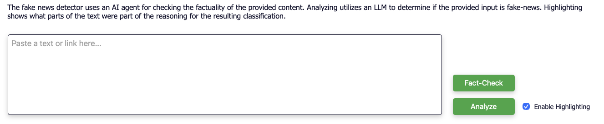

# 

A fullstack Fake News Detector using FastAPI as backend and Svelte as frontend for scoring news, highlighting token contributions, and a fact-checking agent.

## How to use


Open the UI and paste either a supported article URL (via Fundus) or plain text into the input field, then submit it for analysis.
The analysis uses BERT for classification and SHAP for token-level highlights. Fact-checking is done via an LLM model when enabled.

## Features
- Transformer classifier (EN/DE) using BERT models.
- Token/word highlighting via SHAP.
- Fact-check agent using `pydantic-ai` + DuckDuckGo search.
- Svelte UI with highlighting, classifications, and fact-checks.
- Docker setup with Nginx.
- Optional Mongo pipelines and dataset imports for training.

## Repository layout
- `detector-backend/`: FastAPI app (`app/main.py`) plus classifier, fact-check agent, pipelines, and tests.
- `detector-frontend/`: Svelte single-page UI; Nginx config proxies `/api` to the backend.
- `docker-compose.yml`: Local stack (frontend, backend, Mongo).
- `docker-compose.prod.yml`: prebuilt GHCR images.

## Quick start with Docker
The default compose file builds everything locally and exposes the frontend on port 80 and backend on port 8000.

1. Clone the repo.
2. Create `detector-backend/.env` (see `detector-backend/example.env`).
3. Start the stack:
   ```bash
   docker compose up --build
   ```
4. Open `http://localhost` for the UI. The backend API is at `http://localhost:8000`.

Notes:
- First run will download Hugging Face models (can take a few minutes).
- Without `OPENAI_API_KEY`, the fact-check endpoint uses a stub model.

The prod compose file uses prebuilt GHCR images.

## Local development
### Backend
- Requirements: Python 3.13, optionally MongoDB if you use the data pipelines.
- Install deps and run:
  ```bash
  cd detector-backend
  uv sync
  uv run uvicorn app.main:app --reload --host 0.0.0.0 --port 8000
  ```

### Frontend
- Requirements: Node 20+
- Install and run dev server:
  ```bash
  cd detector-frontend
  npm install
  VITE_API_URL=http://localhost:8000/api npm run dev -- --host
  ```
- Build/preview: `npm run build && npm run preview`

## Configuration
### Backend environment variables
Read from `.env` (see `detector-backend/example.env`) and Docker env.

| Variable | Default | Purpose |
| --- | --- | --- |
| `OPENAI_API_KEY` | (unset) | Enables LLM fact-checking. If unset, a test model is used. |
| `LOG_LEVEL` | `INFO` | Backend log level. |
| `MONGO_URL` | `mongodb://mongo:27017` | Mongo connection string. |
| `MONGO_DB_NAME` | `fakenews` | Mongo database name. |

### Frontend environment variables
| Variable | Default | Purpose |
| --- | --- | --- |
| `VITE_API_URL` | `/api` (Docker) | Base URL for the backend API in the frontend. |

## API overview
Base URL `/api`.

- `POST /predict` body: `{ "text": "..." }` classifier label (`fake`|`real`) with confidence for both classes.
- `POST /highlight` body: `{ "text": "..." }` token list with SHAP scores (`score_normalized` for heatmap).
- `POST /fact-check` body: `{ "text": "..." }` structured fact-check (`fake_score`, `summary_analysis`, `checked_claims`).
- `GET /health` simple `{ "status": "ok" }`.

Input note: `text` can be raw text or one/multiple article URLs (one URL per line). URLs are extracted via Fundus, and only supported EN/DE publishers work.

Example:
```bash
curl -X POST http://localhost:8000/api/predict \
  -H "Content-Type: application/json" \
  -d '{"text":"Example news paragraph"}'
```

Example response shapes:
```json
{
  "prediction_result": { "label": "fake", "score": 0.87 },
  "confidence_fake": 0.87,
  "confidence_real": 0.13
}
```

```json
{
  "highlights": [
    { "token": "Example", "score": 0.12, "score_normalized": 0.45 },
    { "token": "news", "score": -0.08, "score_normalized": -0.30 }
  ]
}
```

```json
{
  "fake_score": 0.62,
  "summary_analysis": "Short summary of credibility and style.",
  "checked_claims": [
    { "claim": "Claim A", "assessment": "Misleading", "reasoning": "Brief reasoning." }
  ]
}
```

## Models and behavior
- Models are loaded from Hugging Face at runtime: `Lennywinks/fake-news-detector-english` and `Lennywinks/fake-news-detector-german`.
- Only English and German are supported. Other languages return HTTP 422.
- Highlighting uses SHAP and is slower than plain prediction.
- Fact-checking uses `pydantic-ai` with the OpenAI Responses API (`gpt-5-nano`) when `OPENAI_API_KEY` is set. Otherwise a `TestModel` stub is used.

## Data pipelines 
Pipelines expect datasets under `detector-backend/rawdata/` with these paths:
- `rawdata/WELFake_Dataset/`
- `rawdata/GermanFakeNC/`
- `rawdata/German_News_Dataset/`
- `rawdata/germa/`
- `rawdata/webz_io_Dataset/`

To import all enabled pipelines into MongoDB:
```bash
cd detector-backend
uv run python app/services/data_service.py
```

Training notes live in `detector-backend/notes/detector_training.ipynb`.

## Deployment notes
- `docker-compose.prod.yml` uses published images (`ghcr.io/kon-drees/fake-news-detector-{backend,frontend}:latest`).
- The prod stack reads `OPENAI_API_KEY` and `LOG_LEVEL` from `./.env.prod`.
- For fact checking enter a valid `OPENAI_API_KEY` on the backend service.

## Tests
Backend tests:
```bash
cd detector-backend
uv sync --extra dev
uv run pytest
```

## Troubleshooting
- `422` for unsupported language: only EN/DE are accepted.
- First run is slow: models are downloaded from Hugging Face.
- Fact-check returns placeholders: `OPENAI_API_KEY` missing or too short.
- URL input fails: the publisher may not be supported by Fundus or blocked by `robots.txt`.
- Frontend cannot reach backend: verify `VITE_API_URL`.


## License
See `LICENSE`.
